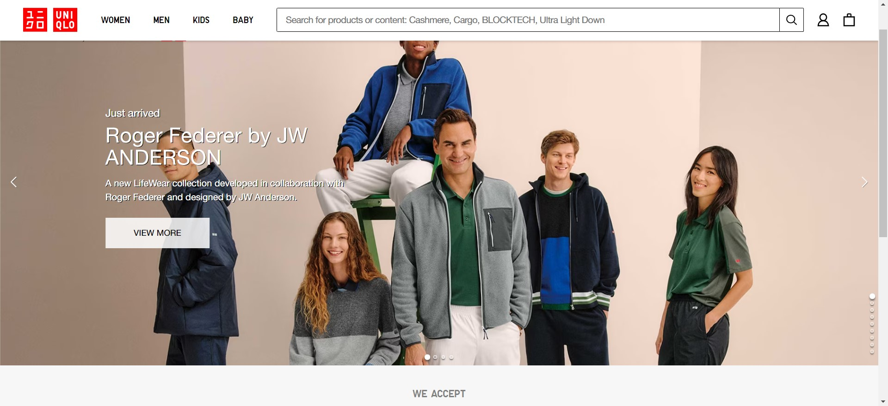
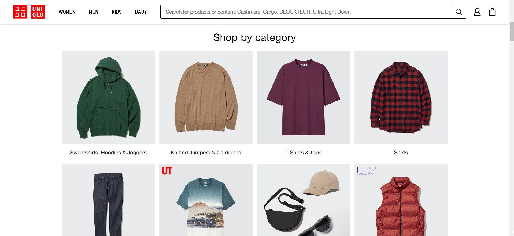
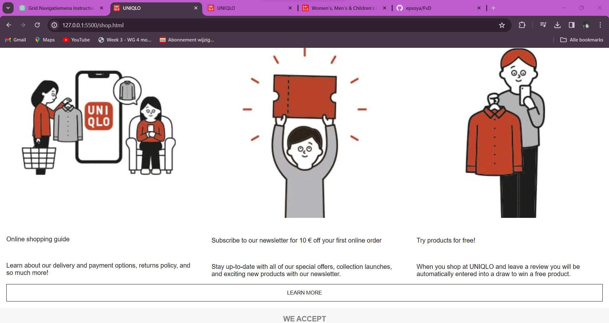
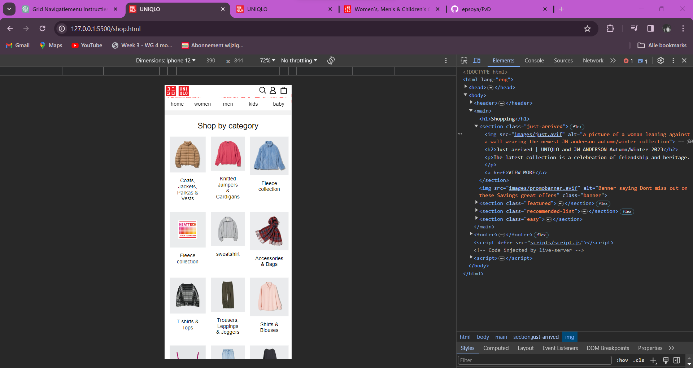
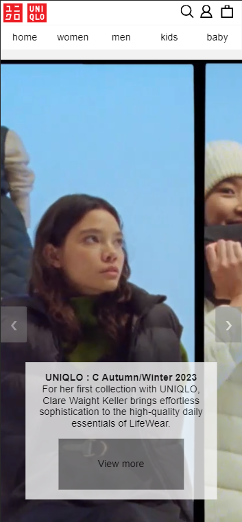
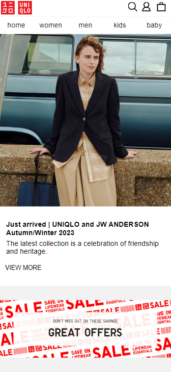
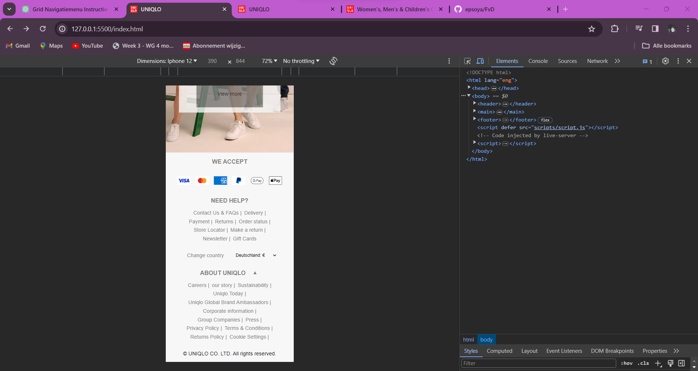
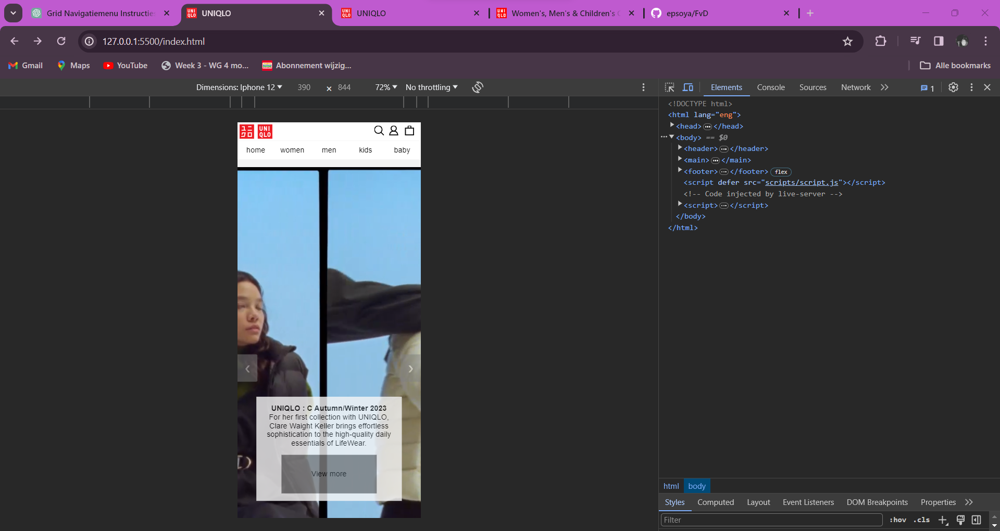

# Procesverslag

Markdown is een simpele manier om HTML te schrijven.  
Markdown cheat cheet: [Hulp bij het schrijven van Markdown](https://github.com/adam-p/markdown-here/wiki/Markdown-Cheatsheet).

Nb. De standaardstructuur en de spartaanse opmaak van de README.md zijn helemaal prima. Het gaat om de inhoud van je procesverslag. Besteedt de tijd voor pracht en praal aan je website.

Nb. Door _open_ toe te voegen aan een _details_ element kun je deze standaard open zetten. Fijn om dat steeds voor de relevante stuk(ken) te doen.

## Jij

  
uitwerken voor kick-off werkgroep

### Auteur:

Elijah Delgado

#### Je startniveau:

Rood

#### Je focus:

Responsive

## Je website

  
uitwerken voor kick-off werkgroep

### Je opdracht:

https://www.uniqlo.com/eu/en/home

#### Screenshot(s) van de eerste pagina (small screen):

Home pagina 
 
 

#### Screenshot(s) van de tweede pagina (small screen):

shopping pagina

 

## Toegankelijkheidstest 1/2 (week 1)

  
uitwerken na test in 2e werkgroep

### Bevindingen

de website zelf is niet heel toegankelijk voor screenreaders zo heb ik bijvoorbeeld gevonden dat

1. alt teksten ontbreken
2. missende focusstates
3. geen aria labels
4. de screenreader leest niet alles

## Voortgang 1 (week 2)

  
uitwerken voor 1e voortgang

### Stand van zaken

doordat ik de eerste week niet aanwezig was door een trouwdag was ik erg gefocust op het bijlopen van mijn achterstand, ik ben wel begonnen met mijn navigatie bar, ik had moeite om weer in te komen met het coderen, dus ik was weer begonnen met oefenen.

### Verslag van voortgangsgesprek

Ik heb nog niet veel kunnen maken, dus als verbeterpunt heb ik gekregen:

- een logische oplossing voor de navigatie bedenken en niet te ingewikkeld moet denken

## Voortgang 2 (week 3)

  
uitwerken voor 2e voortgang

### Stand van zaken

ik ben in week 3 aan de slag gegaan met het maken van de carousel, dit was best moeilijk aangezien ik er nog nooit eentje heb gemaakt. hierbij wat experimenten en gefaalde versies die ik heb uitgeprobeerd.

### Verslag van meeting

hier heb ik wel al een stuk meer kunnen maken, zo is er gekeken naar mijn carousel, dit was erg moeilijk hier heb ik ook veel meer experimenten bij moeten uitvoeren en meerdere rendities, feedback hierop was

- contrast op knoppen en tekst zodat het ook toegangelijk is voor slechziende gebruikers
- gebruik van aria labels zodat de screenreader kan lezen wat er te zien is
- Alt teksten zodat de afbeeldingen gezien kunnen worden.

### Experimenten met mijn carousel:

bij dit experiment ben ik een tutorial gaan volgen alleen werkte dit niet voor mij aangezien ik ook verschillende content toonde in een slide

// // Variables
// let slideIndex = 1;
// let i;
// let slides = document.getElementsByClassName("mySlides");
// let dots = document.getElementsByClassName("dot");

// // Functions
// function plusSlides(n) {
//   showSlides((slideIndex += n));
// }

// function currentSlide(n) {
//   showSlides((slideIndex = n));
// }

// function showSlides(n) {
//   let i;
//   let slides = document.getElementsByClassName("mySlides");
//   let dots = document.getElementsByClassName("dot");
//   if (n > slides.length) {
//     slideIndex = 1;
//   }
//   if (n < 1) {
//     slideIndex = slides.length;
//   }
//   for (i = 0; i < slides.length; i++) {
//     slides[i].style.display = "none";
//   }
//   for (i = 0; i < dots.length; i++) {
//     dots[i].className = dots[i].className.replace(" active", "");
//   }
//   slides[slideIndex - 1].style.display = "block";
//   dots[slideIndex - 1].className += " active";
// }

// document.addEventListener('DOMContentLoaded', function() {
//   const buttons = document.querySelectorAll("[data-carouselButton]");

//   buttons.forEach((button) => {
//     button.addEventListener("click", () => {
//       const offset = button.dataset.carouselButton === "next" ? 1 : -1;
//       const slides = button.closest("[data-carousel]").querySelector("[data-slideItems]");

//       const activeSlide = slides.querySelector("[data-active]");
//       let newIndex = [...slides.children].indexOf(activeSlide) + offset;
//       if (newIndex < 0) newIndex = slides.children.length - 1;
//       if (newIndex >= slides.children.length) newIndex = 0;

//       slides.children[newIndex].dataset.active = true;
//       delete activeSlide.dataset.active;
//     });
//   });

//   function currentSlide(n) {
//     const slides = document.querySelector("[data-slideItems]");
//     const activeSlide = slides.querySelector("[data-active]");

//     if (activeSlide) {
//       delete activeSlide.dataset.active;
//     }

//     slides.children[n - 1].dataset.active = true;
//   }
// });

// function currentSlide(n) {
//   const slides = document.querySelector("[data-slideItems]");
//   const activeSlide = slides.querySelector("[data-active]");

//   if (activeSlide) {
//     delete activeSlide.dataset.active;
//   }

//   slides.children[n - 1].dataset.active = true;
// }

## Toegankelijkheidstest 2/2 (week 4)

  
uitwerken na test in 9e werkgroep

  
  

### Bevindingen

waar ik achter ben gekomen bij de 2e toegankelijkheids test is dat mijn carousel nog niet screenreader vriendelijk is en dat ik nog niet goed genoeg heb nagedacht over de toegankelijkheid van mijn website, zo miss ik aria labels en alt teksten bijvoorbeeld

## Voortgang 3 (week 4)

  
uitwerken voor 3e voortgang

### Stand van zaken

ik ben van start gegaan met de 2e pagina, ik wou mezelf uitdagen door niet alleen te rekenen op flexbox dus ik ben eerst gaan oefenen met grids op de website https://cssgridgarden.com/ zo heb ik geleerd om de lay-out te maken van verschillende onderdelen in mijn website.

## Voortgang 4  

### Stand van zaken 

Hier ben ik bezig geweest met de footer. hier heb ik met gebruik van javascript proberen om een dropdown menu te maken waarbij je de content kon zien wanneer je er overheen zou hoveren met je muis. dit zou mijn micro interactie zijn omdat dit gebruikers helpt om de content te zien voordat je daadwerkelijk de content wilt openen. dit vond ik alleen heel moeilijk en heb ik bepaalde dingen geprobeerd. zo heb ik bijvoorbeeld een toggle kunnen maken zonder hover, of een hover maar dan geen toggle

ook ben ik gaan werken aan  het responsive maken van mijn website door middel van media queries

### Experimenten voor de dropdown en micro interactie

Hier is een voorbeeld van de code waar de dropdown alleen werkt met de toggle maar niet met de hover

// document.getElementById('toggleButton').addEventListener('click', function() {
//   var content = document.getElementById('aboutContent');

//   if (content.style.display === 'none' || content.style.display === '') {
//     content.style.display = 'block';
//     this.innerText = '▲'; // Change the button content to an up arrow
//   } else {
//     content.style.display = 'none';
//     this.innerText = '▼'; // Change the button content back to a down arrow
//   }
// });

// document.getElementById('toggleButton').addEventListener('click', function() {
//   var content = document.getElementById('aboutContent');

//   if (content.style.visibility === 'hidden' || content.style.visibility === '') {
//     content.style.visibility = 'visible';
//     content.style.maxHeight = '3em'; // Adjust the value as needed
//     this.innerText = '▲'; // Change the button content to an up arrow
//   } else {
//     content.style.visibility = 'hidden';
    
//     content.style.maxHeight = '0px';
//     this.innerText = '▼'; // Change the button content back to a down arrow
//   }
// });

## Eindgesprek (week 10)

  
uitwerken voor eindgesprek

### Je uitkomst - karakteristiek screenshots:

  
  
  

### Dit ging goed/Heb ik geleerd:

wat ik goed vond gaan is het oefenen met grid, zo heb ik grid garden uit geprobeerd. Deze technieken heb ik vervolgens vooral toegepast in mijn shop pagina, ook heb ik geleerd om te werken met media queries en wat voor mogelijkheden je daar mee hebt, ik zal vooral de kennis meenemen van grids aangezien dat een hele veelzijdige manier is om de lay-out in te richten.

  

### Dit was lastig/Is niet gelukt:

ik kon er niet voor zorgen dat in de footer de dropdown menu constant blijft werken. als je er een keer overheen hovert blijft de content staan wanneer je er weer af gaat met je muis verdwijnt de content niet. verder vond ik het moeilijk om de navigatie soepel te laten werken met media queries. verder was het maken van de carousel ook erg uitdagend, maar uiteindelijk is het toch gelukt,

  
  

## Bronnenlijst

  
continu bijhouden terwijl je werkt

Nb. Wees specifiek ('css-tricks' als bron is bijv. niet specifiek genoeg).
Nb. ChatGpT en andere AI horen er ook bij.
Nb. Vermeld de bronnen ook in je code.

1. Wiebe, voor het helpen met de svg code in mijn navigatie
2. grid garden, voor het werken met grids bij de featured gedeelte van mijn shop pagina
3. https://www.w3schools.com/howto/howto_js_slideshow.asp , voor de carousel
4. ChatGpt, voor het oplossen van java script problemen die ik niet kon oplossen.

